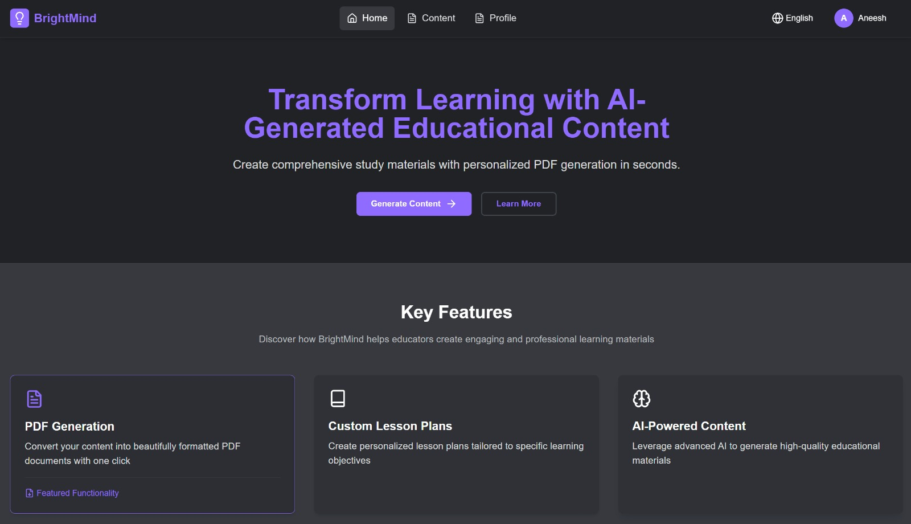
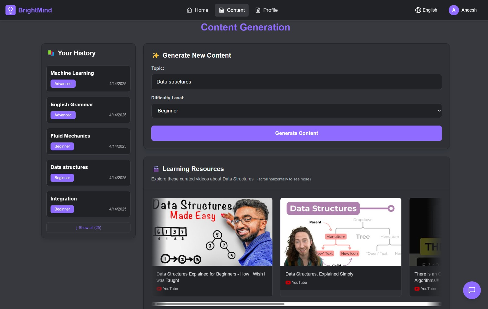
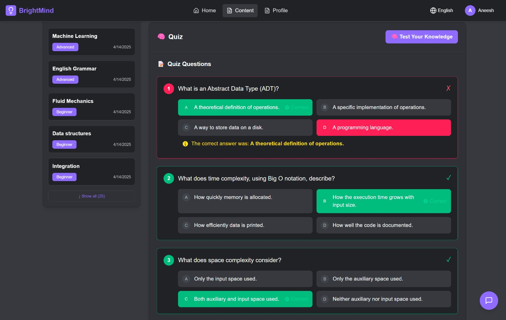

# BrightMind 💡
## Empowering Rural Education with AI



**BrightMind** is an innovative AI-powered educational platform bridging the digital divide in rural and under-resourced communities. By harnessing the capabilities of Gemini 2.0 Flash, we're transforming how educational content is accessed, understood, and utilized in areas with limited resources.

> *"Education is the most powerful weapon which you can use to change the world."* — Nelson Mandela

## 🌟 Our Mission

BrightMind aims to democratize quality education by providing intelligent, accessible learning tools that work even in low-connectivity environments. We believe that geographic location and economic circumstances should never limit a child's potential to learn and grow.

## 🚀 Key Features

### AI-Powered Content Generation




Transform complex educational materials into engaging, easy-to-understand formats:
- **Smart Summaries** — Distill lengthy textbooks into concise, comprehensive summaries
- **Concept Breakdowns** — Simplify difficult concepts with step-by-step explanations
- **Visual Learning Aids** — Generate diagrams and visual representations of abstract ideas

### Interactive Learning Assistant


Our AI-powered doubt-solving companion provides:
- **24/7 Learning Support** — Instant answers to academic questions
- **Personalized Explanations** — Adapts to each student's learning style and pace
- **Guided Problem Solving** — Helps students work through challenges without giving away answers

### Comprehensive Assessment Tools
- **Custom Quiz Generation** — Create assessments tailored to specific learning objectives
- **Progress Tracking** — Monitor student improvement with detailed analytics
- **Adaptive Testing** — Questions adjust in difficulty based on student performance

### Offline Accessibility
- **Downloadable Resources** — Save all content as PDFs for offline use
- **Low-Bandwidth Mode** — Optimized experience for areas with limited connectivity
- **Offline First Design** — Core functionality works without constant internet connection

### Teacher Empowerment
- **Lesson Plan Generator** — Create comprehensive teaching materials in minutes
- **Multilingual Content Translation** — Instantly translate educational content into regional languages

## 🌐 Language Support

BrightMind currently supports:
- English
- Hindi
- Kannada

*More languages coming soon!*

## 💻 Technology Stack

### Frontend
- **Web Platform**: Next.js with TypeScript
- **Mobile App**: React Native with Expo
- **UI Framework**: Tailwind CSS & Native Base
- **State Management**: Redux Toolkit

### Backend
- **API Framework**: Django REST Framework
- **Database**: SQLite (development)
- **Authentication**: JWT with Django Simple JWT

### AI Integration
- **Core Model**: Gemini 2.0 Flash for content generation
- **API Integration**: Gemini 2.0 Flash

## 🚀 Getting Started

### Prerequisites
- Python 3.8+
- Node.js 16+
- npm or yarn
- React Native environment (for mobile development)

### Backend Setup
```bash
# Clone the repository
git clone https://github.com/yourusername/brightmind.git
cd brightmind

# Set up Python virtual environment
cd backend
python -m venv venv
source venv/bin/activate  # On Windows: .\venv\Scripts\activate

# Install dependencies
pip install -r requirements.txt

# Configure environment
cp .env.example .env
# Edit .env with your API keys and configurations

# Run migrations
python manage.py migrate

# Start development server
python manage.py runserver
```

### Web Frontend Setup
```bash
# Navigate to frontend directory
cd ../frontend

# Install dependencies
npm install

# Start development server
npm run dev
```

### Mobile App Setup
```bash
# Navigate to mobile directory
cd ../Appdev

# Install dependencies
npm install

# Start the Metro bundler
npm start

# Run on Android or iOS
npm run android
# or
npm run ios
```

---

<p align="center">
  <b>Illuminating minds, transcending boundaries</b><br>
  A project by the BrightMind Educational Foundation
</p>
